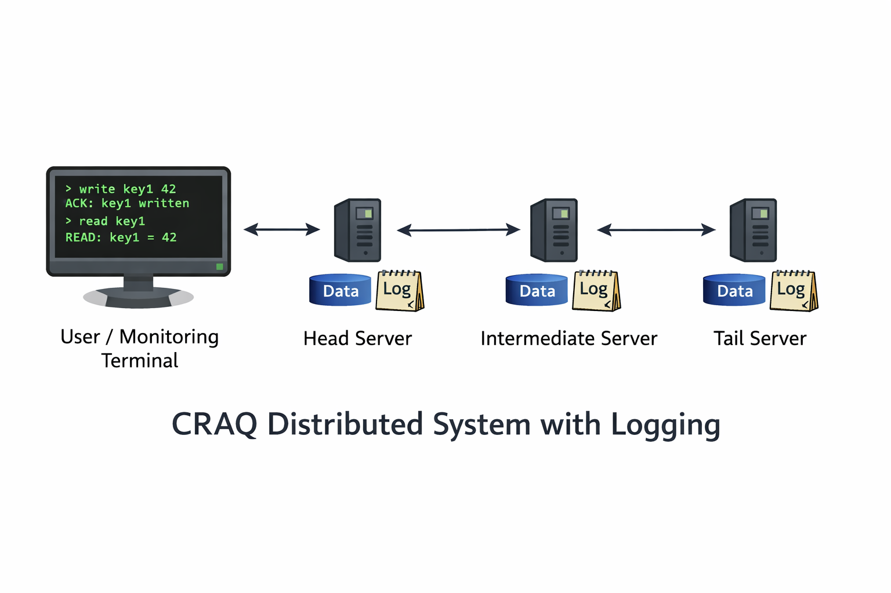

# Simulated-CRAQ-Server

## Overview

**Simulated-CRAQ-Server** is a Go implementation of a distributed storage system based on **Chain Replication with Asynchronous Queries (CRAQ)**, designed to make replication, consistency, and message-passing behavior observable and interactive.

The project models a networked environment consisting of:

- a **virtual switch** that routes messages between components
- a **chain of CRAQ servers** that maintain replicated state
- a **user client / monitoring process** with an interactive command-line interface

The system is built around **message passing** using Go channels and goroutines. Rather than having components call one another directly, each part of the system communicates through structured frames with typed payloads. This makes the project useful both as a CRAQ prototype and as a demonstration of actor-style concurrency in Go.



This project is intended as:

- a learning tool for distributed systems concepts
- a prototype implementation of CRAQ-style replication
- a demonstration of concurrency and channel-based communication in Go

---

## Quick Setup and Monitoring

This project is designed to be run interactively and observed through its log files.

### Running the Simulation

Ensure the following files are in the same directory:

* switch.go
* CRAQServers.go
* Simple_CRAQ_trial.go
* go.mod

From that directory, run:

```bash
go run .
```

This will:

* initialize the virtual switch
* connect the user client
* spawn the CRAQ server chain
* begin the interactive REPL

Note that the script will create a new directory `Log_Files/` in the project directory to store both user and server logs.
If this directory already exists and the user does not have write permission, the program may fail to run.

---

### Using the REPL

Once the program starts, you can interact with the system using the following commands:

* `help` — display available commands
* `ping` — send a ping to a specific server
* `read` — read a key from a specified server
* `write` — write a key/value pair (always sent to the head server)
* `quit` — gracefully shut down the system

You will be prompted for any required inputs (such as server ID or key).

---

### Monitoring the System (Recommended)

The simulation is best understood by watching the logs in real time.

Open **multiple terminal windows** and run:

```bash
tail -f Log_Files/User_Log.txt
```

```bash
tail -f Log_Files/CRAQLog_Server_0.txt
```

```bash
tail -f Log_Files/CRAQLog_Server_<n>.txt
```

Where:

* `CRAQLog_Server_0.txt` is the **head server**
* `CRAQLog_Server_<n>.txt` should be replaced with the **tail server ID**

---

### What to Watch For

By monitoring these logs side by side, you can observe:

* user commands and responses
* write propagation from head → tail
* commit propagation from tail → head
* deferred reads and waitlist release behavior
* timing and ordering of distributed events

This multi-terminal `tail -f` setup provides the clearest view into how the CRAQ protocol operates in this simulation.

---

### Note on Timing

The simulation includes intentional delays (on the order of hundreds of milliseconds to about a second) in the processing of reads, writes, and commits.

These delays are designed to:

* make message propagation observable in real time
* allow events to be followed clearly in the log files
* highlight ordering and timing relationships in the protocol

As a result, the system runs significantly slower than a production implementation. 
This is intentional — the goal is to make the behavior of the CRAQ protocol easy to monitor and understand using tools like `tail -f`.

---


## High-Level Architecture

The simulation creates a small message-passing distributed environment with the following components.

### Virtual Switch

The switch acts as the network router for the simulation. It assigns ports to devices, tracks where each device is attached, and forwards frames based on destination IDs.
The switch is currently implemented with a fixed number (8) of available ports.

### CRAQ Server Chain

A linear chain of CRAQ replicas is created. Each server knows:

- its own server ID
- its position in the chain
- whether it is the **head** or **tail**
- the IDs of its predecessor and successor when applicable

### User Client / Monitoring Process

The user connects to the switch as a simulated client and interacts with the system through a REPL. The user process also logs replies and errors to a dedicated user log.

### Logging Subsystem

Each server writes to its own log file, and the user process writes to a separate user log. This supports observation, debugging, and protocol tracing.


---

## CRAQ Overview

CRAQ (Chain Replication with Asynchronous Queries) is implemented here as a linear chain of replicas defined by `CRstruct`.
Each node in the chain stores a table of `(key, value)` pairs (integers), along with a version number and a dirty flag used to track pending updates. 

### Roles in the chain

- **Head node**
  - accepts all writes
  - assigns versions
  - creates pending log entries
  - begins write propagation down the chain

- **Intermediate nodes**
  - forward writes toward the tail
  - track dirty state while writes are pending
  - process commits coming back up the chain

- **Tail node**
  - finalizes writes
  - generates commit messages
  - serves consistent reads directly

This structure allows the simulation to demonstrate the relationship between replication order, commit propagation, and read consistency.

---

## Design Choices and Tradeoffs

This simulation follows the core ideas of CRAQ but makes several intentional design choices for clarity and implementation simplicity.

### Deferred Reads Instead of Tail Forwarding

In a standard CRAQ implementation, a non-tail replica receiving a read for a dirty key may forward the request to the tail to guarantee a consistent response.

In this simulation, a different approach is used:

- non-tail replicas defer reads on dirty entries
- the requesting client is placed on a per-key waitlist
- once the corresponding commit arrives, all waiting reads are released

This design was chosen primarily for ease of implementation and to highlight the relationship between:

- pending writes
- commit propagation
- read availability

It also makes the effects of replication latency more visible in the logs.

### Simplified Network Model

The system uses a single centralized switch with a fixed number of ports rather than a fully distributed network. This keeps routing logic simple and allows focus on replication behavior rather than network complexity.

### In-Memory State and Logs

All data structures (DataTable, CRAQLog) are maintained in memory, and logs are used for observability rather than durability. This avoids persistence concerns and keeps the implementation focused on protocol behavior.

### Static Chain Configuration

The chain structure is fixed at startup. While hooks for reconfiguration exist, dynamic reconfiguration is not fully implemented. This simplifies reasoning about message flow and correctness.

---

## Possible Future Improvements

There are several natural directions for extension.

### Raft-Style Control Layer

- Introduce a Raft-style consensus layer to manage leader election, membership changes, and fault tolerance
- Enable dynamic reconfiguration of the CRAQ chain in response to node failures or topology changes
- Promote a leader responsible for coordinating updates to the chain structure and ensuring consistency across replicas
- Integrate reconfiguration with the existing replication logic to maintain correctness during transitions

The current implementation includes stubs for chain reconfiguration (e.g., UpdateChainStructure), which were added specifically to support this future extension.

### CRAQ-layer improvements

- more detailed logging of ignored protocol cases
- refactoring duplicated commit logic
- richer reconfiguration support
- better recovery and fault handling
- improved observability/debugging tools

### Switch improvements

- dynamic number of ports
- multiple switches
- richer route propagation/topology management
- packet delay or loss at the switch layer

---

## Stress Testing and Validation

A deterministic stress test is included to demonstrate system behavior under interleaved reads and writes.

See: `stress_tests/CRAQ_Stress_Test.go`

💡 Insight:
Because CRAQ allows reads from non-tail replicas, consistency becomes a function of both replication state and timing. This test makes those timing-dependent behaviors visible by forcing controlled overlaps between reads and writes.

---

## Final Notes

This project emphasizes:

- clarity of distributed-system behavior
- visibility of protocol flow
- explicit message-passing design
- concurrency through goroutines and channels
- observability through logging

It is intentionally structured to make the CRAQ protocol **transparent and inspectable**, rather than optimized for production deployment. As a result, it works well as both a systems-learning project and a portfolio example demonstrating distributed-systems ideas in Go.
